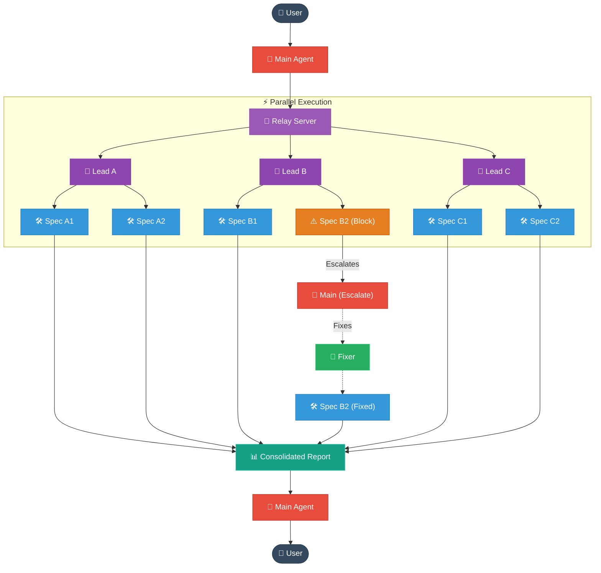

<div align="center">
  <h1>🤖 OpenCode Agent Teams Relay</h1>
  <p><strong>Async Department-Lead Orchestration & Parallel Sub-Agent Relay Engine for OpenCode</strong></p>

  <p>
    
    
    
    
    
    
  </p>
</div>

---

## 📌 Project Overview

**`opencode-agent-teams-relay`** is a portable, production-grade orchestration package and background relay engine for [OpenCode](https://github.com/sst/opencode). 

It introduces **true asynchronous sub-agent fan-out** and a multi-agent **Department Lead architecture** into OpenCode. Instead of running single sequential sub-tasks that block your session, `opencode-agent-teams-relay` allows an orchestrator agent (`Agent-Teams`) to launch unlimited child agents in parallel, keep working independently, and react to results as they complete.

Built on the principle of **Management by Exception**, successful sub-agent work digests silently into final reports, while **blockers or failures trigger immediate escalations** to spawn targeted fixer leads concurrently.

---

## ⚡ Features

- 🚀 **Async Parallel Fan-Out**: Non-blocking `running_agents` tool launches unlimited child sessions without freezing your OpenCode TUI.
- 📡 **Detached SDK Relay Engine**: External Node.js background process connects via `@opencode-ai/sdk`, tracking `session.idle` and `session.error` events in real-time via SSE.
- 🏢 **7 Department Leads & 67 Specialists**: Pre-configured orchestrators (`Frontend`, `Backend`, `Security`, `DevOps`, `AI & Data`, `QA`, `Agent-Teams`) routing tasks to specialized domain agents.
- ⚡ **Management by Exception**: Unblocked work digests silently; blockers trigger immediate escalations so fixers dispatch in parallel without waiting for unblocked streams.
- 🛡️ **OS Port Auto-Discovery**: Dynamic `listen(0)` free-port binding for auxiliary server fallbacks — zero collisions with Docker Desktop, IDE language servers, or OS ephemeral ports.
- 🔒 **Shared-Secret Security**: Authenticated HTTP communications using 32-byte tokens stored in XDG-compliant state directories (`AppData/Local/opencode/...`).
- 📦 **1-Command Safe Installer**: Non-destructive installer featuring automated full-config backups, rollback capability, and smart marked-block `AGENTS.md` merging.

---

## 📊 Performance & Measured Impact

*Real numbers from an in-repo orchestration run (Aug 2026). Items labeled **measured** are evidenced facts from that run; everything else is a **modeled estimate** with labeled confidence — never presented as fact.*

### What actually happened (measured ✅)

| Fact | Value |
|---|---|
| Fan-out shape | 1 main orchestrator → **4 department leads** in one parallel batch → each spun **13 specialists** of their own |
| Total concurrent sessions | **18** (1 main + 4 leads + 13 specialists) |
| Wall-clock to final synthesis | **≈15 minutes** (measured floor) |
| Cross-team escalations | **8** raised & routed while other tracks kept running — none forced the run to stop |

> Methodology: the first drain call returned with zero completions (no lead had finished); the four leads then drained sequentially, with the slowest lead bounding the headline runtime. **15 minutes is the measured floor**, not a ceiling — larger tasks amortize the coordination tax further.

### Counterfactual: the same task as a single agent (modeled estimate)

A single agent doing all four departments must work serially and hold one monolithic context:

1. **Wall-clock ≈ 4× slower.** Four department passes in sequence (~11–15 min each) → **45–60 min total**. No LLM parallelism — one brain, one token stream at a time; nothing is "background-computed."
2. **Context exhaustion risk.** One agent accumulates the entire task across all four domains. Past a point, truncation/eviction risk → incomplete deliverables → re-runs, which multiply effective time *and* tokens.
3. **Worse token profile per useful unit.** A single agent re-reads shared files, holds cross-domain working notes, and emits extra tokens just to keep state coherent in one window — the "same budget, worse signal-to-noise" failure mode.

### Side-by-side

| Metric | Team (measured) | Single agent (modeled) |
|---|---|---|
| Wall-clock to complete run | **≈15 min** | ≈45–60 min |
| Concurrent work-streams | **18** | 1 |
| Context per unit of work | Small, focused per agent | Monolithic, grows to overflow |
| Blocker breakdown | Escalated & fixed in parallel | Run stalls |
| Risk of context overflow / truncation | **~0 sessions lost** | High (everything at risk near the end) |
| Total raw LLM tokens | Higher (more sessions, duplicated groundwork) | Baseline (fewer, but less reliable) |

### The honest trade-off

Team orchestration is **not** "faster *and* cheaper on tokens" — that's the part elevator pitches get wrong. The real exchange is:

> **You trade total tokens produced for elapsed wall-clock time, fault isolation, and a focused context per responsibility.**

- **More total tokens** — 18 sessions each reason independently (duplicated groundwork, shared-file reads) vs. one session.
- **Far less wall-clock (~4×)** and **far lower truncation risk** — work advances in parallel and each context stays small.

The coordination "tax" is real: orchestrator handoff, re-briefing each agent, collecting results — non-trivial per-turn overhead. **It pays off only when a task is big enough to amortize that tax** — i.e., decomposable into independent tracks.

### Bottom line

> ⏱ **~15 min vs ~1 hr** (measured vs modeled) · 🔀 **18 parallel sessions vs 1** · 📉 **~4× wall-clock reduction** via parallel fan-out · 🛡 **escalations recover concurrently, not serially**. The team made the run **~4× faster and dramatically safer at the tail end**, at the explicit cost of **higher total LLM tokens** — the classic tokens-for-throughput swap.

---

## 🏗️ Architecture



---

## 📋 Prerequisites First

> ⚠️ **Important:** Ensure you have the following installed before running the quick start installer:
> 1. **OpenCode** installed and configured on your machine.
> 2. **Node.js >= 20.0.0** available in your `PATH`.
> 3. Active terminal session with access to `npx`.

---

## ⚡ Quick Start

Deploy `opencode-agent-teams-relay` directly to your local OpenCode environment with one command:

```powershell
npx opencode-agent-teams-relay
```

This launches an interactive TUI installer menu:

```text
  Agent-Teams Relay Manager
  =========================

  > 1. Install / Upgrade Agent-Teams
    2. Revert to Backup
    3. Check Status
    4. Uninstall
    5. Exit
```

---

## ⚙️ Installation Modes

The package ships **two install modes**. Both install the curated department agents
and the `AGENTS.md` orchestration block; they differ in everything else.

### `full` — default, for stock opencode

```powershell
npx opencode-agent-teams-relay-install
# or, from this repo:
.\install.ps1
```

Installs **all** of:

1. Curated agents — `agents/orchestrators/*.md` + `agents/specialists/*.md`
2. The `AGENTS.md` orchestration block (marker-based merge, preserves your rules)
3. The **agent-teams plugin** — `plugins/agent-teams.ts` (the `running_agents` /
   `next_agent` / `agents_status` tools)
4. The **relay** — `relay/agent-teams-relay.mjs`
5. The `@opencode-ai/plugin` npm dependency in your opencode config `package.json`

This is the mode for **stock opencode users** running the plugin-based orchestration.

### `agents` — agents-only, for the native fork

```powershell
npx opencode-agent-teams-relay-install --agents-only
# or, from this repo:
.\install.ps1 -AgentsOnly
```

Installs **only**:

1. Curated agents — `agents/orchestrators/*.md` + `agents/specialists/*.md`
2. The `AGENTS.md` orchestration block

It does **NOT** install the plugin, the relay, or the `@opencode-ai/plugin` npm
dependency, and does **NOT** modify your `package.json`. It never removes other
users' plugins (in agents mode only `plugins/agent-teams.ts` is managed).

This mode is intended for users running the **native fork** engine, where the
core implements background sub-agent orchestration natively and the plugin is
redundant — but the curated agents and orchestration rules still apply.

### Mode marker & uninstall

Every install writes `.installed-mode` (`"full"` or `"agents"`) into your
opencode config dir. The uninstaller reads it so it only removes what that mode
manages — `uninstall` in agents mode never touches other user plugins,
`node_modules`, `opencode.json`, or `package.json`. `npx
opencode-agent-teams-relay-uninstall status` prints the installed mode.
Re-running the installer switches modes (e.g. full → agents removes the plugin,
relay and npm dep; agents → full restores them).

---

## 🛠️ Commands & Automation

For CI/CD scripts or automated deployment, use non-interactive binary commands:

| Command | Description |
|---|---|
| `npx opencode-agent-teams-relay` | Interactive TUI menu (install, upgrade, revert, status) |
| `npx opencode-agent-teams-relay-install` | Direct, non-interactive installation script (full mode) |
| `npx opencode-agent-teams-relay-install --agents-only` | Agents-only install (no plugin/relay/npm — native fork) |
| `npx opencode-agent-teams-relay-uninstall` | Non-interactive uninstaller & revert utility |

### Non-Interactive Flag Examples

```powershell
# Direct silent installation (full mode)
npx opencode-agent-teams-relay-install

# Agents-only installation (native fork — no plugin/relay/npm)
npx opencode-agent-teams-relay-install --agents-only

# Check current installation, installed mode & available backups
npx opencode-agent-teams-relay-uninstall status

# Revert to most recent automatic backup
npx opencode-agent-teams-relay-uninstall revert

# Revert to a specific backup version
npx opencode-agent-teams-relay-uninstall revert v0.1.0

# Complete clean uninstall (preserves custom AGENTS.md rules; agents-only mode
# also preserves any other user plugins)
npx opencode-agent-teams-relay-uninstall uninstall
```

### Local PowerShell Installation

```powershell
cd c:\Dev\opencode\orchestration
.\install.ps1                       # full mode (default)
.\install.ps1 -AgentsOnly           # agents-only mode (native fork)
```

---

## 📑 Department Leads & Agents

This package provisions **7 Orchestrators** and **67 Specialist Agents** into your `~/.config/opencode/agents/` directory:

| Department | Orchestrator Agent | Specialized Domain Agents |
|---|---|---|
| ⚡ **Async Fan-Out** | **`Agent-Teams`** | Multi-agent parallel routing (`running_agents`, `next_agent`, `agents_status`) |
| 🎨 **Frontend** | `Frontend` | `Frontend Developer`, `UI Designer`, `UX Architect`, `Accessibility Auditor`, `USWDS Developer` |
| ⚙️ **Backend** | `Backend` | `Backend Architect`, `Database Optimizer`, `API Platform Engineer`, `Payments Billing Engineer`, `Rust Refactoring Specialist` |
| 🛡️ **Security** | `Security` | `Security Architect`, `Penetration Tester`, `Cloud Security Architect`, `Secrets Credential Hygiene Engineer`, `Privacy Engineer` |
| 🚀 **DevOps** | `DevOps` | `DevOps Automator`, `SRE (Site Reliability Engineer)`, `FinOps Engineer`, `IoT Fleet Engineer`, `Incident Response Commander` |
| 🧠 **AI & Data** | `AI & Data` | `AI Engineer`, `RAG Pipeline Engineer`, `Prompt Engineer`, `Data Engineer`, `Search Relevance Engineer` |
| 🧪 **QA** | `QA` | `Test Automation Engineer`, `API Tester`, `Performance Benchmarker`, `Reality Checker`, `Test Results Analyzer` |

---

## 🔄 Upgrade & Automatic Backup System

Every installation automatically creates a full, timestamped backup before modifying your configuration:

1. **Detection:** Reads `.installed-version` in your OpenCode config folder.
2. **Full Backup:** Copies entire config state to `~/.config/opencode/.backups/<version>-<timestamp>/`.
3. **Smart Merge:** Injects or updates the `AGENTS.md` orchestration block using start/end markers (`<!-- agent-teams-orchestration:start -->`), **preserving all existing user rules**.
4. **Pruning:** Automatically keeps the last 5 backups and prunes older entries to conserve space.

### Backup Storage Directory

```text
~/.config/opencode/.backups/
├── v0.1.0-2026-08-05T20-45-00/
│   ├── agents/
│   ├── plugins/
│   ├── relay/
│   └── .installed-version
└── .backup-version
```

---

## 🔒 Security & Context Isolation

- **Token Protection:** The background relay generates a cryptographically secure 32-byte hex token on startup. All IPC requests require a matching `Authorization: Bearer <token>` header.
- **Port Isolation:** Every OpenCode server URL gets a unique, hash-derived relay port (20000–50000). Multiple terminal windows and projects remain completely isolated.
- **Context Preservation:** Sub-agent completions return **only final assistant text summaries** to parent sessions, preventing transcript inflation.

---

## 🤝 Contributing

Contributions of new specialized agents, workflow patterns, and relay optimizations are welcome! Please feel free to open an issue or submit a pull request.

---

## 📄 License

Distributed under the **MIT License**. See [`LICENSE`](LICENSE) for details.
